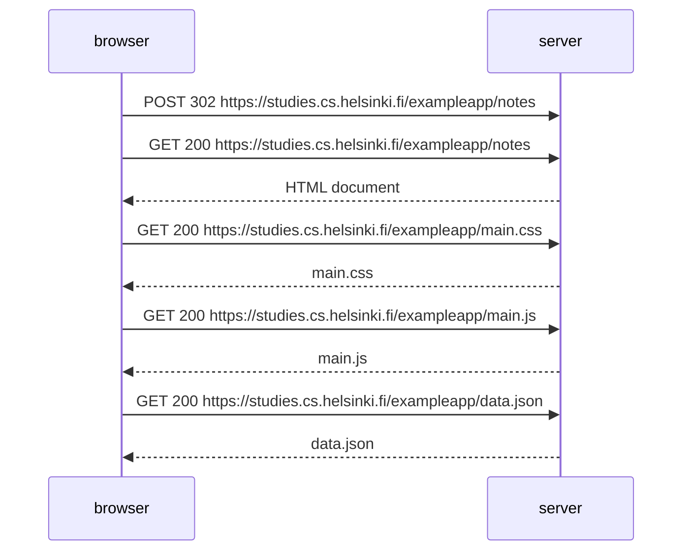

```mermaid
sequenceDiagram
    participant browser
    participant server

    browser ->> server: POST 302 https://studies.cs.helsinki.fi/exampleapp/notes

    browser ->> server: GET 200 https://studies.cs.helsinki.fi/exampleapp/notes
    server -->> browser: HTML document

    browser ->> server: GET 200 https://studies.cs.helsinki.fi/exampleapp/main.css
    server -->> browser: main.css

    browser ->> server: GET 200 https://studies.cs.helsinki.fi/exampleapp/main.js
    server -->> browser: main.js

    browser ->> server: GET 200 https://studies.cs.helsinki.fi/exampleapp/data.json
    server -->> browser: data.json

```